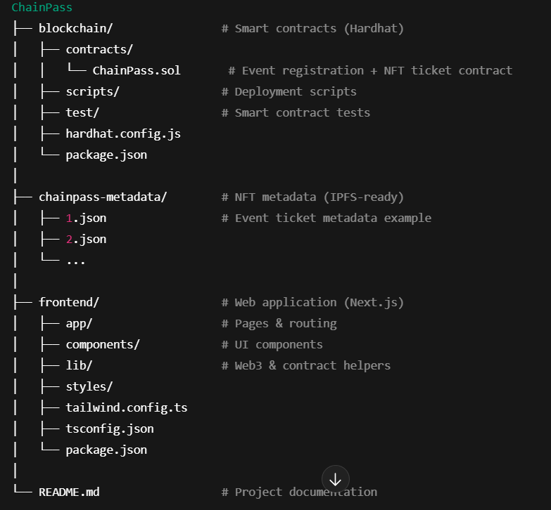

ChainPass 🎟️

Decentralized Event Registration & NFT Ticketing dApp
ChainPass is a decentralized event registration platform built on Ethereum that allows users to register for events by paying a fee and receive an on-chain NFT ticket as proof of registration. The system enforces participant limits and registration deadlines automatically through smart contracts, ensuring transparency, security, and trustless execution.

________________________________________
## 📌 Project Overview

Traditional event registration systems often rely on centralized platforms, which can lead to issues such as overbooking, lack of transparency, manual payment verification, and fraud. ChainPass addresses these issues by leveraging blockchain technology to create a trustless, transparent, and automated event registration flow. The project demonstrates Web3 application using Solidity smart contracts and a React-based frontend, deployed on the Ethereum Sepolia testnet.
________________________________________
## ✨ Features
•	Create events with fees, deadlines, and participant limits
•	Open and close event registrations on-chain
•	Register for events by paying ETH
•	Automatic enforcement of:
o	Maximum participants
o	Registration deadlines
•	Mint NFT tickets upon successful registration
•	Cancel registration and receive refunds (before deadline)
•	View registered participants per event
•	Secure smart contract design with reentrancy protection
________________________________________
## 🧱 Project Architecture
ChainPass
├── blockchain/        # Smart contracts (Hardhat)
│   ├── contracts/
│   │   └── ChainPass.sol
│   ├── scripts/
│   ├── test/
│   ├── hardhat.config.js
│   └── package.json
├── chainpass-metadata
├── frontend/          # Web application (Next.js)
│   ├── app/
│   ├── components/
│   ├── lib/
│   ├── styles/
│   ├── tailwind.config.ts
│   ├── tsconfig.json
│   └── package.json
│
└── README.md

________________________________________
## 🔗 Tech Stack
Blockchain
•	Solidity
•	Hardhat
•	OpenZeppelin Contracts
•	Ethereum (Sepolia Testnet)

Frontend
•	Next.js
•	React
•	TypeScript
•	TailwindCSS
•	Ethers.js
•	MetaMask

Tooling & Infrastructure
•	Alchemy RPC
•	GitHub
•	Mocha / Chai (testing)
________________________________________
## 🚀 Smart Contract Overview
The ChainPass.sol smart contract handles:
•	Event creation and management
•	Registration logic and payment handling
•	NFT ticket minting (ERC-1155)
•	Refunds and cancellation
•	Organizer withdrawals
•	On-chain participant tracking
Key Concepts
•	Each event is mapped to a unique eventId
•	NFT tickets use the eventId as the token ID
•	Tickets act as on-chain proof of registration
•	NFT metadata is served via tokenURI (IPFS)
________________________________________

## 🖥️ Frontend Overview
The frontend is built with Next.js and provides:
•	Wallet connection via MetaMask
•	Event listing and details pages
•	Event registration with ETH payment
•	User confirmation via NFT ticket
•	Participant visibility (read-only on-chain data)
The frontend communicates directly with the smart contract using Ethers.js, with no backend server involved.
________________________________________

## ⚙️ Installation & Setup
1️⃣ Clone the repository

git clone https://github.com/KwabenaAnane/Chain-Pass-Project.git
cd Chain-Pass-Project
________________________________________
2️⃣ Blockchain Setup (Hardhat)

cd blockchain
npm install

Compile contracts:
npx hardhat compile

Deploy to Sepolia:
npx hardhat ignition ignition/modules/ChainPass.ts --network sepolia 
________________________________________
3️⃣ Frontend Setup (Next.js)

cd frontend
npm install
npm run dev
Update contract address and ABI in the frontend config.

Create a .env.local file:

NEXT_PUBLIC_WALLETCONNECT_PROJECT_ID=your_wallet_connect_key
NEXT_PUBLIC_ALCHEMY_API_KEY=your_Alchemy_API_key
________________________________________

## 🧪 Testing
Smart contract tests are written using Mocha and Chai.
cd blockchain
npx hardhat test
npx hardhat test test/ChainPass.ts --coverage
________________________________________

## 🔐 Security Considerations
•	Reentrancy protection using ReentrancyGuard
•	Strict validation for payments, deadlines, and limits
•	Organizer-only access for sensitive actions
•	No personal user data stored on-chain (GDPR-friendly)
________________________________________

## ⚖️ Legal Considerations
ChainPass avoids storing personal data on-chain and only uses wallet addresses for identification. All transactions are transparent and immutable. As the project operates on a testnet, it is intended for educational and demonstration purposes.
________________________________________

## 📄 Documentation
•	Inline smart contract comments
•	README (this file)
•	Clear contract event logs for frontend integration
•	NFT metadata structure documented via tokenURI
________________________________________

## 📌 Future Improvements
•	QR-code scanning for event entry
•	Organizer dashboard analytics
•	Multi-event NFT metadata folders
•	Mainnet deployment with audits
________________________________________
## 📚 References
•	Ethereum & Solidity Documentation
•	OpenZeppelin Contracts
•	Hardhat Documentation
•	RainbowKit
•	Wagmi
•	Alchemy
________________________________________

